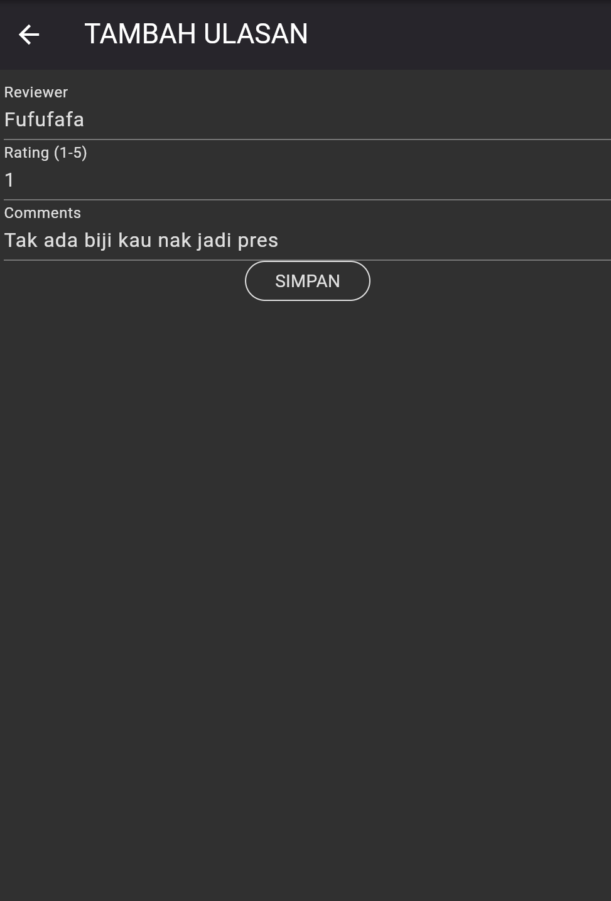

# Aplikasi Manajemen Pariwisata bagian Ulasan

Berikut adalah tampilan halaman-halaman utama dari bagian ulasan :

### 1. Halaman Ulasan

### 2. Registrasi

### 3. Berhasil Registrasi

### 4. Login

### 5. Detail Ulasan

### 6. Edit Ulasan

### 7. Hapus Ulasan

### 8. Tambah Ulasan

### 9. Logout

